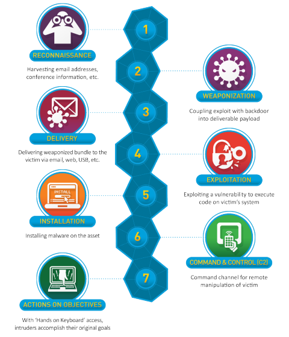
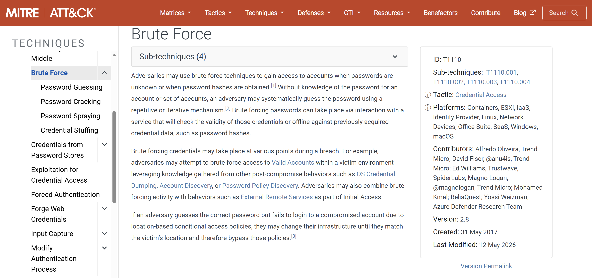
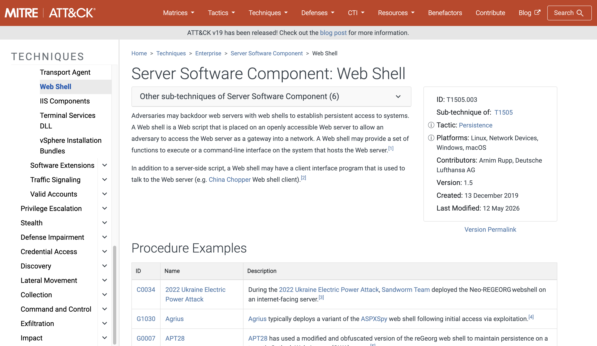

# E7 — MITRE ATT&CK : Reconstruction d'une Chaîne d'Attaque Complète
 
> Rapport de synthèse final de l'investigation **Buttercup Games**. Cet article relie les 6 épisodes précédents en une kill chain complète, mappée sur le framework MITRE ATT&CK, et constitue le rapport d'escalade transmis à l'équipe N2.
 
---
 
## 📚 Table des matières
 
- [1. Contexte global](#1-contexte-global)
- [2. Cyber Kill Chain® — Lockheed Martin](#2-cyber-kill-chain--lockheed-martin)
- [3. Kill Chain complète — Buttercup Games](#3-kill-chain-complète--buttercup-games)
- [4. Détail des techniques ATT&CK](#4-détail-des-techniques-attck)
- [5. Gaps d'investigation](#5-gaps-dinvestigation)
- [6. Rapport d'escalade — Éléments transmis à l'équipe N2](#6-rapport-descalade--éléments-transmis-à-léquipe-n2)
- [7. Conclusion](#7-conclusion)

 
## 1. Contexte global
 
L'équipe SOC de **Buttercup Games** a détecté et investigué une série d'attaques coordonnées contre l'infrastructure de la société. L'investigation a débuté par la détection d'un email de phishing et s'est conclue par la découverte d'un webshell actif sur le serveur web.
 
L'attaquant, persistant et méthodique, a adapté sa tactique à chaque échec — du phishing à la reconnaissance web, puis au brute force FTP.
 
**Timeline des incidents :**

<br>
 
<div align="center">

| Épisode | Outil | Incident détecté |
|:---:|:---:|:---:|
| [E1](https://github.com/Paulcyber06/E1-Phishing-Proton-Brand-Impersonation) | Email | Tentative de phishing usurpant Proton for Business |
| [E2](https://github.com/Paulcyber06/E2-Splunk-Reconnaissance-Detection) | Splunk | Reconnaissance web — IP sondant `/passwords.pdf` |
| [E3](https://github.com/Paulcyber06/E3-Splunk-Behavioral-Analysis) | Splunk | Analyse comportementale — double activité suspecte |
| [E4](https://github.com/Paulcyber06/E4-Splunk-Dashboard-and-Alerts) | Splunk | Dashboard SOC + alerte automatique configurée |
| [E5](https://github.com/Paulcyber06/E5-Wireshark-FTP-Brute-Force) | Wireshark | Brute force FTP — compte `jenny` compromis |
| [E6](https://github.com/Paulcyber06/E6-Wireshark-Post-Exploitation) | Wireshark | Post-exploitation — webshell `shell.php` déployé |

</div>

 <br>
 
## 2. Cyber Kill Chain® — Lockheed Martin
 
Le framework **Cyber Kill Chain®**, développé par Lockheed Martin, identifie les 7 phases que tout attaquant doit compléter pour atteindre son objectif. Interrompre l'attaque à n'importe quelle phase suffit à la neutraliser.
 
<div align="center">
  
[](https://www.lockheedmartin.com/en-us/capabilities/cyber/cyber-kill-chain.html)

</div>
 

 
<div align="center">

| Phase | Description |
|:---:|:---:|
| 1. Reconnaissance | L'attaquant collecte des informations sur la cible |
| 2. Weaponization | Création d'un payload exploitant une vulnérabilité |
| 3. Delivery | Livraison du payload — email, web, USB |
| 4. Exploitation | Exécution du code sur le système cible |
| 5. Installation | Installation d'un outil de persistance |
| 6. Command & Control | Canal de communication avec la machine compromise |
| 7. Actions on Objectives | L'attaquant atteint son objectif final |

</div>


> ⚠️ **Dans l'investigation Buttercup Games, l'attaquant a été bloqué aux phases 3 et 4 lors de ses premières tentatives** — il a dû changer de tactique avant de réussir.

 *Source : [Lockheed Martin — Cyber Kill Chain®](https://www.lockheedmartin.com/en-us/capabilities/cyber/cyber-kill-chain.html)*
 
---
 
## 3. Kill Chain complète — Buttercup Games
 
Mapping de l'investigation sur le framework MITRE ATT&CK :
 
| Phase Kill Chain | Technique MITRE | ID | Outil | Résultat | Épisode |
|-----------------|----------------|-----|-------|---------|---------|
| Reconnaissance | File and Directory Discovery | [T1083](https://attack.mitre.org/techniques/T1083/) | Splunk | ✅ `/passwords.pdf` non trouvé | [E2](https://github.com/Paulcyber06/E2-Splunk-Reconnaissance-Detection) / [E3](https://github.com/Paulcyber06/E3-Splunk-Behavioral-Analysis) |
| Delivery | Phishing | [T1566](https://attack.mitre.org/techniques/T1566/) | Email | ✅ Employé non piégé | [E1](https://github.com/Paulcyber06/E1-Phishing-Proton-Brand-Impersonation) |
| Exploitation | Brute Force | [T1110](https://attack.mitre.org/techniques/T1110/) | Wireshark | ❌ Credentials compromis : jenny/password123 | [E5](https://github.com/Paulcyber06/E5-Wireshark-FTP-Brute-Force) |
| Exploitation | Valid Accounts | [T1078](https://attack.mitre.org/techniques/T1078/) | Wireshark | ❌ Connexion FTP réussie | [E5](https://github.com/Paulcyber06/E5-Wireshark-FTP-Brute-Force) |
| Installation | Web Shell | [T1505.003](https://attack.mitre.org/techniques/T1505/003/) | Wireshark | ❌ shell.php déployé dans /var/www/html | [E6](https://github.com/Paulcyber06/E6-Wireshark-Post-Exploitation) |
| Actions on Objectives | Exploit Public-Facing Application | [T1190](https://attack.mitre.org/techniques/T1190/) | Wireshark | ❌ Webshell accédé via navigateur Linux | [E6](https://github.com/Paulcyber06/E6-Wireshark-Post-Exploitation) |

[](https://attack.mitre.org)

*Source : [MITRE ATT&CK® Matrix for Enterprise](https://attack.mitre.org)*
 
---
 
## 4. Détail des techniques ATT&CK
 
### [T1566](https://attack.mitre.org/techniques/T1566/) — Phishing
**Épisode 1** — L'attaquant, ayant eu connaissance que Buttercup Games utilise **Proton**, a usurpé l'identité de Proton pour tenter de voler les credentials d'un employé via une fausse page de connexion hébergée sur `vercel.app`.
 
<div align="center">

| Indicateur | Valeur |
|:---:|:---:|
| SPF | ❌ fail |
| DMARC | ❌ fail |
| DKIM | ⚠️ pass — signé par `bttlazer[.]org` (domaine attaquant) |
| Résultat | ❌ Échec — employé non piégé |

</div>
 
### [T1083](https://attack.mitre.org/techniques/T1083/) — File and Directory Discovery
**Épisodes 2 & 3** — L'IP `87.194.216.51` a sondé activement le serveur web à la recherche de fichiers sensibles sur une période de **7 jours**.

 <div align="center">
  
| Indicateur | Valeur |
|-----------|--------|
| Cible principale | `/passwords.pdf` — tentée 3 fois |
| Technique | Slow and low — basse fréquence pour éviter la détection |
| Double activité | 894 accès réussis simultanés aux tentatives de reconnaissance |
| Résultat | ❌ Échec — fichier non trouvé |

 </div>
 
 
### [T1110](https://attack.mitre.org/techniques/T1110/) — Brute Force
**Épisode 5** — N'ayant pas trouvé `/passwords.pdf`, l'attaquant a lancé une attaque brute force FTP contre le compte `jenny`.

 [](https://attack.mitre.org/techniques/T1110/)

 <div align="center">
 
| Indicateur | Valeur |
|-----------|--------|
| Date | 2021-02-01 à 23:26:22 |
| Credentials trouvés | jenny / password123 |
| Wordlist probable | rockyou.txt |
| Résultat | ❌ Compromission réussie |

  </div>

 
### [T1078](https://attack.mitre.org/techniques/T1078/) — Valid Accounts
**Épisode 5** — Après avoir trouvé les credentials, l'attaquant s'est connecté au serveur FTP avec le compte `jenny` à **23:26:31**.
 
 
### [T1505.003](https://attack.mitre.org/techniques/T1505/003/) — Web Shell
**Épisode 6** — En moins de 15 secondes après la connexion FTP :

[](https://attack.mitre.org/techniques/T1505/003/)
 
<div align="center">
 
| Heure | Action |
|-------|--------|
| 23:26:31 | Connexion FTP réussie |
| 23:26:33 | Identification du répertoire : `/var/www/html` |
| 23:26:39 | Upload : `shell.php` |
| 23:26:41 | `CHMOD 777 shell.php` — permissions d'exécution |
| 23:26:58 | Accès au webshell via navigateur |
 </div>
 
### [T1190](https://attack.mitre.org/techniques/T1190/) — Exploit Public-Facing Application
**Épisode 6** — Confirmation de l'accès au webshell :
 
```
GET /shell.php HTTP/1.1
Host: 192.168.0.115
User-Agent: Mozilla/5.0 (X11; Linux x86_64; rv:78.0) Firefox/78.0
```
<div align="center">
    
| Indicateur | Valeur |
|-----------|--------|
| IP serveur victime | 192.168.0.115 |
| OS attaquant | Linux x86_64 |
| Navigateur | Firefox 78.0 |

   </div>
   
---
 
## 5. Gaps d'investigation
 
En tant qu'analyste SOC L1, certaines questions restent sans réponse et nécessitent une investigation approfondie par l'équipe N2 :
 
| Question | Hypothèse | Priorité |
|----------|-----------|---------|
| Comment l'attaquant a-t-il obtenu le nom d'utilisateur `jenny` ? | Ancien employé / connaissance interne / document obtenu en amont non détecté | 🔴 Critique |
| L'IP `87.194.216.51` et l'attaquant FTP sont-ils la même personne ? | Mode opératoire similaire — méthodique et persistant | 🟡 À confirmer |
| Le webshell a-t-il été utilisé après le premier accès ? | Non déterminé — nécessite analyse des logs serveur web | 🔴 Critique |
| D'autres comptes ont-ils été ciblés ? | Non déterminé — nécessite analyse complète des logs FTP de la session du 2021-02-01 | 🟡 À vérifier |
 
---
 
## 6. Rapport d'escalade — Éléments transmis à l'équipe N2
 
### 🔴 Actions immédiates requises
 
- Supprimer `/var/www/html/shell.php` du serveur
- Désactiver le compte `jenny` et forcer la réinitialisation du mot de passe
- Bloquer les IPs `192.168.0.115` et `87.194.216.51` au niveau du pare-feu
- Isoler le serveur victime le temps de l'investigation
### 📋 Éléments de preuve collectés

 <div align="center">
 
| Élément | Source | Épisode |
|---------|--------|---------|
| Email de phishing + IOCs | Analyse email | E1 |
| IP suspecte `87.194.216.51` | Logs Splunk | E2/E3 |
| Dashboard SOC actif | Splunk | E4 |
| Credentials compromis jenny/password123 | Capture Wireshark | E5 |
| Webshell shell.php dans /var/www/html | Capture Wireshark | E6 |
| OS attaquant : Linux x86_64, Firefox 78.0 | Capture Wireshark | E6 |
| Heure de compromission : 2021-02-01 23:26:31 | Capture Wireshark | E5/E6 |

  </div>
 
### 🔍 Investigation complémentaire demandée à l'équipe N2
 
- Analyser les logs Apache pour détecter tout accès à `shell.php` après le premier
- Vérifier les logs FTP pour identifier d'autres tentatives de brute force
- Corréler l'IP `87.194.216.51` avec l'IP source de l'attaque FTP
- Investiguer l'origine du nom d'utilisateur `jenny`
---
 
## 7. Conclusion
 
> 🔴 **La société Buttercup Games a été compromise. Un webshell actif est présent sur le serveur web.**
 
Cette investigation illustre une attaque en **trois phases distinctes** :
 
1. **Tentative d'accès social** (E1) — Phishing Proton → ❌ échec
2. **Reconnaissance et cartographie** (E2/E3/E4) — IP cherche `/passwords.pdf` → ❌ échec
3. **Accès direct par force brute** (E5/E6) — Brute force FTP → ✅ compromission totale en 32 secondes
**Ce que cette investigation démontre :**
 
Un attaquant déterminé ne s'arrête pas à un premier échec. Il adapte sa tactique jusqu'à trouver le maillon faible — ici, un mot de passe faible sur un protocole non chiffré (FTP).
 
**Ce que le SOC a mis en place :**
- Dashboard de surveillance automatique (E4)
- Alertes en temps réel sur les comportements suspects
- Documentation complète pour l'escalade N2


<div align="center">
<br>

[](https://github.com/Paulcyber06/E6-Wireshark-Post-Exploitation)
[](https://github.com/Paulcyber06)

<br>
</div> 

---

## 📁 Reproduire cette analyse
 
Ce rapport est basé sur les investigations des épisodes E1 à E6.
Tous les fichiers sources sont disponibles dans leurs articles respectifs :
 
- **E1** — Email de phishing réel (non distribué pour des raisons de confidentialité)
- **E2/E3/E4** — [tutorialdata.zip Splunk](https://docs.splunk.com/images/Tutorial/tutorialdata.zip)
- **E5/E6** — [TryHackMe — room h4cked](https://tryhackme.com/room/h4cked)


*© Paulcyber06 — Tous droits réservés.*
